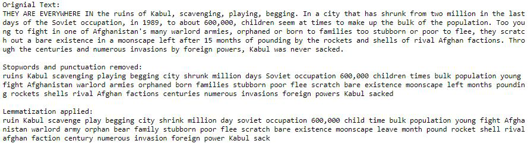

# (PART) Preprocess breadtext {-}

# Preprocess Breadtext for both Datasets

<style>
div.green { background-color:#93c47d; border-radius: 5px; padding: 20px;}
</style>
<div class = "green">
This chapter is written in Python. To see the original file go to the folder python_scripts/.
</div>


<style>
div.blue { background-color:#76a5af; border-radius: 5px; padding: 20px;}
</style>
<div class = "blue">
All the code in the chapter is run on both df_NYT and df_guardian but here i only show the processing df_NYT.
</div>

Now we are going to move into the domain of Natural Language Processing (NLP). This is a huge field with many applications and many methods/analysis. Moreover there are a ton of packages in both R and Python for doing NLP. I have chosen to use a package in python called `spacy`. This package is really powerful and has great documentation. See their webpage to get started: https://spacy.io/.

So, going back to the project we have scraped the breadtext from all the articles. We need to preprocess that text before we can apply NLP-analysis. We also use `spacy` to preprocess the text because it has some useful functions. The preprocessing contains three major steps:

1. We remove punctuation and special characters.
2. We remove *stopwords*. Stopwords are those common/neutral words that do not add meaning to a text. These are words such as *allow* or *a*. 
3. We *lemmatize* all the words. Lemmatization is the process of returning all words to their most basic form, the *lemma*. For example, the verb *to walk* may appear as *walk*, *walked* or *walking*. Lemmatization returns all these forms of walking to their base form *to walk*. 

All right, lets see some code. We run all the code below for both `df_NYT` and `df_guardian`, but I only show the code for `df_NYT`.
We start by loading packages and data.

```{python, eval = F, python.reticulate = F}
import spacy
import numpy as np
import pandas as pd

#importing the stopwords
from spacy.lang.en.stop_words import STOP_WORDS

#loading the dataframes and combining them 
df1 = pd.read_csv("data/new_york_times/NYT_clean_1.csv")
df2 = pd.read_csv("data/new_york_times/NYT_clean_2.csv")

#combining
df = pd.concat([df1, df2])
```

Then we load what is called the english small pipeline from `spacy`. This is basicly a nlp-model with lots of cool functions that we are going to use. We also exclude certain components of the pipeline that we dont need to speed up processing. 
```{python loading model, eval = F, python.reticulate = F}
nlp = spacy.load("en_core_web_sm", exclude=["ner", "entity_linker", "entity_ruler"])
```

Now we can define helper functions that performs the preprocessing steps described above. We first define a function that removes punctuation, special characters and stopwords. It takes 'article' as argument which is one breadtext from an article. It then converts that article to an `nlp-object` which is necesarry for the functions to work. It then looks through all the tokens (which is basically all the words) and filters out special characters, stopwords and extra spaces. 

```{python helperfunction12, eval = F, python.reticulate = F}
# function for Removing punctuation, stopwords and special chars from a sentence using spaCy 
def remove_special_chars_and_stopwords(article):
 article = nlp(article)
 article = ' '.join([token.text for token in article 
 if token.is_punct != True and 
     token.is_quote != True and 
     token.is_bracket != True and 
     token.is_currency != True and 
     token.is_digit != True and
     token.is_stop != True])
 #removing extra spaces
 article = " ".join(article.split())
 return nlp(article)
```

We define another helper function which performs the lemmatizing. It looks through all the words and converts them to their lemma. 
```{python helperfunction2, eval = F, python.reticulate = F}
#function for lemmatizing
def lemmatize(sentence):
    article = ' '.join([word.lemma_ for word in 
    sentence])
    return nlp(article)
```


Now, lets see how these functions work on a small snippet of text from an article. We first print the original text, then the text after stopwords and punctuation are removed and finally after lemmatization is applied. We see how the text becomes shorter and less readable for us mere humans when these steps are applied. But for the functions in `spacy` the last text is just yummi.  
```{python try on single text, eval = F, python.reticulate = F}
#trying out the function on a single text
article = df.iloc[28,3]
print("Orignial Text: ")
print(article[0:582]  + "\n")

#removing special chars and stopwords
article = remove_special_chars_and_stopwords(article)
print("Stopwords and punctuation removed: ")
print(str(article)[0:405]  + "\n")

#lemmatizing the article
article = lemmatize(article)
print("Lemmatization applied:")
print(str(article)[0:362] + "\n")
```




We now know that the helper functions do what they are supposed to do. This means that we can apply those functions to all the articles in a for-loop. 
```{python large iteration1, eval = F, python.reticulate = F}
#defining index to loop over
article_index = 0

#defining lists for the cleaned articles
articles_clean = []

#looping over bread texts from all articles and running the functions on them
for article in df.index:
    #load article using index
    article = df.iloc[article_index,3]
    
    #cleaning the article
    article = remove_special_chars_and_stopwords(article)
    
    #lemmatizing the article
    article = lemmatize(article)
    
    #appending the clean article to a list of clean articles
    articles_clean.append(article)
    
    #indexing to next article
    article_index += 1
    
    #checking progress
    print(article_index)
    
    
#making a new column in df containing the cleaned bread text
df['bread_text_preprocessed'] = articles_clean
```

Lastly we save it to three datasets. Otherwise the files are too large for Git. 
```{python large iteration, eval = F, python.reticulate = F}
#splitting into three datasets
df1 = df.iloc[0:7500,]
df2 = df.iloc[7501:15000,]
df3 = df.iloc[15001:21113, ]

#saving to three new files
df1.to_csv("data/new_york_times/NYT_clean_1.csv", index = False)
df2.to_csv("data/new_york_times/NYT_clean_2.csv", index = False)
df3.to_csv("data/new_york_times/NYT_clean_3.csv", index = False)
```

All good. We are now done with cleaning, wrangling and preprocessing. We are ready for analysis!
