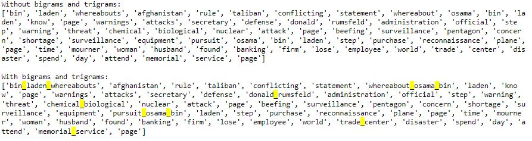
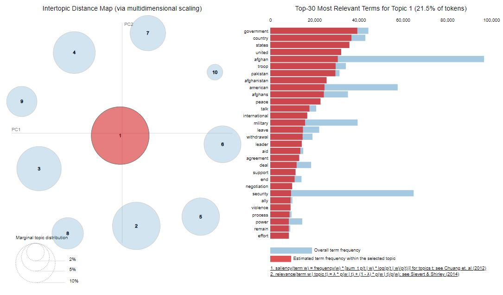
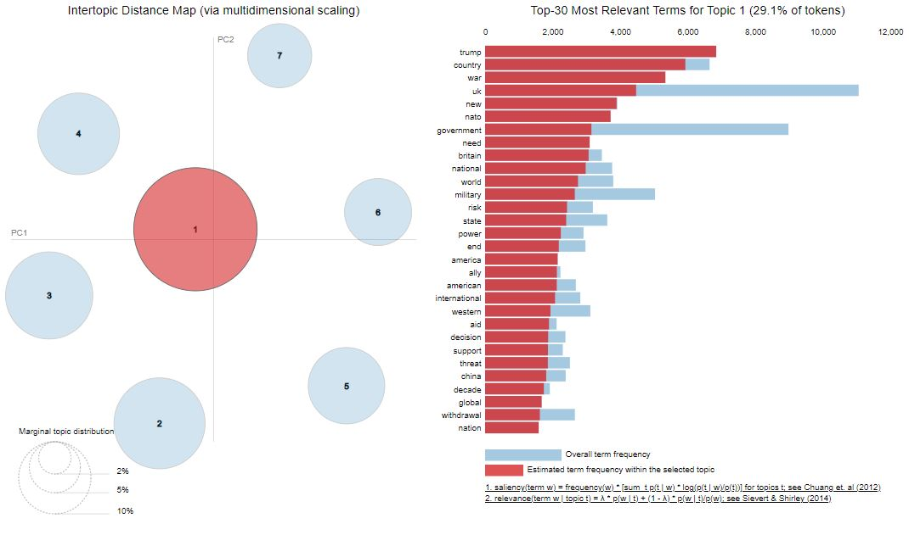

# LDA Topic Modelling

<style>
div.green { background-color:#93c47d; border-radius: 5px; padding: 20px;}
</style>
<div class = "green">
Part of this chapter is written in Python. To see the original file go to the folder python_scripts/.
</div>

<style>
div.blue { background-color:#76a5af; border-radius: 5px; padding: 20px;}
</style>
<div class = "blue">
All the code in the chapter is run on both df_NYT and df_guardian but some of the code is only shown for df_nyt. 
</div>


In this Chapter we are going to make a LDA topic model for the dataset `df_nyt` and `df_guardian`.

## Packages and Data

Lets get to the code. We load a bunch of packages. Importantly, we will use a new library called `gensim` which is used for topic modelling. We also use `spaCy` and `pyLDAvis` which is used for vizualizing the model output.
```{python, eval = F, python.reticulate = F}
import numpy as np
import pandas as pd
import glob
 
#Gensim
import gensim
import gensim.corpora as corpora
from gensim.utils import simple_preprocess
from gensim.models import CoherenceModel
from gensim.models import TfidfModel
from gensim.models import CoherenceModel

#spacy
import spacy

#vis
import pyLDAvis
import pyLDAvis.gensim_models
```

Then we load the dataset containing the articles. 
```{python, eval = F, python.reticulate = F}
df1 = pd.read_csv("data/new_york_times/NYT_clean_1.csv")
df2 = pd.read_csv("data/new_york_times/NYT_clean_2.csv")
df3 = pd.read_csv("data/new_york_times/NYT_clean_3.csv")

df = pd.concat([df1, df2, df3])
```

## Preprocessing
 
Although the bread text of all the articles is already preprocessed (lemmatization, removal of stopwords and removal of punctuation) we still need a little bit of preprocessing to make the LDA topic model. Here we define a helper function that break down the articles by individual words and apply a function called `simple_preprocess` from `gensim`. 
```{python helperfunction1, eval = F, python.reticulate = F}
def gen_words(texts):
    final = []
    for text in texts:
        new = gensim.utils.simple_preprocess(text)
        final.append(new)
    return (final)
```


We use the function on the articles from the dataset, to generate a list of all the articles broken down into words called `data_words`. 
```{python apply helperfunction2, eval = F, python.reticulate = F}
data_words = gen_words(df["articles_clean"])
```

Now lets see what this helper function actually did.
```{python apply helperfunction1, eval = F, python.reticulate = F}
print("Before applying the helper function gen_words: \n" + str(df.iloc[0,4][0:142]))
print("\nAfter applying the helper function gen_words: \n" + str(data_words[0][0:20]))
```


This is how the data looks before and after applying the helper function `gen_words`. Before application we see that the data is simply a collection of words. After application we see that all the words have been split into their element in a list. So now each article is a list where the elements of that list is the individual words. 


## Bigrams and Trigrams

Next up we make *bigrams* and *trigrams*. Bigrams are 2 consecutive word in a sentence that occur with a high frequency. Trigrams are 3 consecutive words in a sentence that occur with a high frequency. Lets take an example where we have the following sentences:

1. The connection of devices is *wireless*.
2. The *speakers* have a solid bass.
3. The *wireless speakers* are expensive. 

In sentence 1 the word *wireless* occurs by itself. Similarly, in sentence 2 the word *speakers* occur by itself. However, in sentence 3 the two words occur together in a meaningful way to form a single unit. If *wireless speakers* occurs with a high enough frequency, we call it a bigram. 

Now we get to the code. We look for bigrams using the function `Phrases` from the library `gensim`. This function takes `data_words` which we created earlier and `min_count` which determines the minimum number of times two words need to occur together to be considered a bigram. It also takes `threshold` which determines the the number of phrases that are found. A higher threshold will result in fewer bigrams. It is important to adjust the threshold so it doesn't pick up too few or too many bigrams. We also look for trigrams using the same function but this time using the `bigram_phrases` as input. 
```{python bigram trigram1, eval = F, python.reticulate = F}
bigram_phrases = gensim.models.Phrases(data_words, min_count=5, threshold=80)
trigram_phrases = gensim.models.Phrases(bigram_phrases[data_words], threshold=80)
```

Then we create the objects `bigram` and `trigram`. 
```{python bigram trigram2, eval = F, python.reticulate = F}
bigram = gensim.models.phrases.Phraser(bigram_phrases)
trigram = gensim.models.phrases.Phraser(trigram_phrases)
```

Next we make two functions that add the bigrams and trigrams into `data_words`. 
```{python bigram trigram3, eval = F, python.reticulate = F}
def make_bigrams(texts):
    return([bigram[doc] for doc in texts])

def make_trigrams(texts):
    return ([trigram[bigram[doc]] for doc in texts])
```

Here we apply the functions. 
```{python bigram trigram4, eval = F, python.reticulate = F}
data_bigrams = make_bigrams(data_words)
data_bigrams_trigrams = make_trigrams(data_bigrams)
```

Now lets see which bigrams and trigrams have been picked up. 
```{python test bigram trigram, eval = F, python.reticulate = F}
print("Without bigrams and trigrams:\n" + str(data_words[1067][0:100]))
print ("\nWith bigrams and trigrams:\n" + str(data_bigrams_trigrams[1067][0:100]))
```


In the first section without bigrams and trigrams we see that the data appears as individual units. In the second section we see the same words as before but we also see bigrams and trigrams highlighted by a yellow color. 


## TF-IDF Removal
TF-IDF is a statistical measure that evaluates how relevant a word is to a document in a collection of documents. It is a way of ranking how important a word is to a document in a collection of documents. TF-IDF is short for *term frequency - inverse document frequency*.
Term frequency is the frequency of a word in a document. You simply count how many times a word appears in a document. Inverse document frequency indicates how common or rare a word is in the entire collection of documents. The closer to 0, the more common a word is in the collection of documents. Multiplying these two numbers results in the TF-IDF score for a word. The higher the score, the more relevant a word is to a particular document.

TF-IDF has many applications. Here i use it to remove words that don't add any meaningful value to the topic model. I am going to remove frequently occurring words such as *say*. The reason we do this is that some words are so generic that they do not add any meaningful information to the topics in the topic model.  The result of this removal is that our topics will be more distinct, i.e. there will be less overlap between topics.

We start be defining the object `texts` which is the list of words of all articles containing bigrams and trigrams. 
```{python removing frequent words1, eval = F, python.reticulate = F}
texts = data_bigrams_trigrams
```

Then we make a dictionary from `texts` which counts the occurrence of words in each article.  
```{python removing frequent words2, eval = F, python.reticulate = F}
id2word = corpora.Dictionary(texts)
```

We convert all the documents into a bag of words.
```{python removing frequent words3, eval = F, python.reticulate = F}
corpus = [id2word.doc2bow(text) for text in texts]
```

We make the TD-IDF model and a variable called `low_value` which determines the threshold where words are removed. A higher threshold will result in more words being removed. 
```{python removing frequent words, eval = F, python.reticulate = F}
tfidf = TfidfModel(corpus, id2word=id2word)
low_value = 0.03
```

Here is a large chunk of code, but don't sweat it. It basically looks for words that are so generic across all documents that they don't add any meaningful value to the topic model. The end product is a new corpus where these generic words are removed. 
```{python removing frequent words4, eval = F, python.reticulate = F}
words = []
words_missing_in_tfidf = []

for i in range(0, len(corpus)):
    bow = corpus[i]
    low_value_words = [] #reinitialize to be safe. You can skip this.
    tfidf_ids = [id for id, value in tfidf[bow]]
    bow_ids = [id for id, value in bow]
    low_value_words = [id for id, value in tfidf[bow] if value < low_value]
    drops = low_value_words+words_missing_in_tfidf
    for item in drops:
        words.append(id2word[item])
    words_missing_in_tfidf = [id for id in bow_ids if id not in tfidf_ids] # The words with tf-idf score 0 will be missing

    new_bow = [b for b in bow if b[0] not in low_value_words and b[0] not in words_missing_in_tfidf]
    corpus[i] = new_bow
```

So now our texts contain bigrams and trigrams and frequently occurring words have been removed. Now to the fun part. 

## Base topic model
Now we can finally create the LDA topic model using `gensim`. The two main inputs to the topic model are our dictionary/id2word and corpus which we created earlier. We can adjust many hyperparameters such as `random_state` and `alpha` to make the model perform optimally. We can also choose the number of topics in `num_topics`. Here i just choose 10 topics.  
```{python ldamodel, eval = F, python.reticulate = F}
lda_model = gensim.models.ldamodel.LdaModel(corpus = corpus,
                                            id2word = id2word,
                                            num_topics = 10,
                                            random_state = 100,
                                            update_every = 1,
                                            chunksize = 100,
                                            passes = 10,
                                            alpha = "auto",
                                            )
```

Now we can visualize the model. If you want to play around with it yourself go to the original python script.
```{python vis, eval = F, python.reticulate = F}
pyLDAvis.enable_notebook()
vis = pyLDAvis.gensim_models.prepare(lda_model, corpus, id2word, mds = "mmds", R=30)
vis
```


In the base topic model for New York Times we see that 10 topics have been created. On the left we see topics 1-10 plotted on a 2-dimensional space. The size of the circles indicate the prevalence of the topic throughout the articles. Larger means more prevalent. We see that the topics are well spread throughout the 2-dimensional space and that there is no obvious overlap between topics. On the right we see the top-words for topic number 1. 


## Selecting the number of topics based on coherence score
There are many ways of evaluating an LDA topic model to see if it performs as we intend it to. Likewise there are many hyperparameters that can evaluated and tuned accordingly such as *alpha* and *beta*. Here i will evaluate the model by choosing the number of topics using something called a coherence score. There are many coherence measures, here I use one called `C_v`.

In the next section of code I compute the coherence score for topic models with a varying number of topics to see which number of topics is the optimal. 

I start by defining a helper function which creates an LDA model. It takes `k` as argument which is the number of topics. It then adds a coherence measure to the model and returns a coherence score. 
```{python helpercoherence1, eval = F, python.reticulate = F}
def compute_coherence_values(k):
    lda_model = gensim.models.ldamodel.LdaModel(corpus=corpus,
                                           id2word=id2word,
                                           num_topics=k, 
                                           random_state=100,
                                           chunksize=100,
                                           passes=10,
                                           alpha="auto")
    
    coherence_model_lda = CoherenceModel(model=lda_model, texts=data_bigrams_trigrams, dictionary=id2word, coherence='c_v')
    return coherence_model_lda.get_coherence()
```

Now that we defined a helper function we can iterate over a range of topics, create a topic model for each and calculate a coherence score for each topic model. I used a range of 1:30 topics with a step size of 2. We save the result as a dataframe. 
```{python coherenceiteration, eval = F, python.reticulate = F}
# Topics range
min_topics = 1
max_topics = 30
step_size = 2
topics_range = range(min_topics, max_topics, step_size)

#empty dataframe
model_results = {'Topics': [],
                 'Coherence': []
                }

# iterate through number of topics
for k in topics_range:
    print(k)
    # get the coherence score for the given topics
    cv = compute_coherence_values(k=k)
    # Save the model results
    model_results['Topics'].append(k)
    model_results['Coherence'].append(cv)
    

pd.DataFrame(model_results).to_csv('data/lda_topic_model/tuning_results_nyt.csv', index=False)    
```

### Selecting number of topics for New York Times
We now move into R for a lil bit to make some plots. Here we load packages `tidyverse` [@tidyverse2019], `wesanderson` [@R-wesanderson] and `RColorBrewer` [@R-rcolorbrewer].
```{r}
pacman::p_load(tidyverse, wesanderson, RColorBrewer)
```

Here I quickly define some color palettes with colors that i like. These palettes will be used for different plots. The same colors will be used consistently throughout the notebook.
```{r}
color_palette_newspaper <- c(wes_palette("Chevalier1")[1], wes_palette("Darjeeling2")[2])
```

Lets plot the coherence score against number of topics for New York Times. 
```{r tuning_nyt, message = F, fig.cap = "Coherence score plotted for topic models with varying number of topics. 7 Topics are chosen for the topic model in New York Times"}
lda_tuning_results_NYT <- read_csv("data/lda_topic_model/tuning_results_NYT.csv")

lda_tuning_results_NYT %>%
    ggplot() + 
    aes(x=Topics, y=Coherence) + 
    geom_point(color = color_palette_newspaper[1], size = 1.1) + 
    geom_line(color = color_palette_newspaper[1], size = 1.2) +
    scale_x_continuous(breaks = seq(1, 30, by = 2)) + 
    theme_minimal() + 
    labs(x="Number of Topics", y="Coherence Score", title = "Choosing Optimal Number of Topics for New York Times") + 
    ylim(0.38,0.52)
```
Figure \@ref(fig:tuning_nyt) outlines the coherence score for the number of topics in the topic model on articles from New York Times.
We want to pick the value in the graph where there is a breaking point. This is the point where the coherence score is highest before flattening out. In other words we want to pick the lowest number of topics where the coherence score begins to level off. 
**I choose to go with 7 topics for the topic model in New York Times**

### Selecting number of topics for The Guardian
```{r tuning_guardian, message = F, warning = F, fig.cap = "Coherence score plotted for topic models with varying number of topics. 7 Topics are chosen for the topic model in The Guardian"}
lda_tuning_results_guardian <- read_csv("data/lda_topic_model/tuning_results_guardian.csv")

lda_tuning_results_guardian %>%
    ggplot() + 
    aes(x=Topics, y=Coherence) + 
    geom_point(color = color_palette_newspaper[2], size = 1.1) + 
    geom_line(color = color_palette_newspaper[2], size = 1.2) +
    scale_x_continuous(breaks = seq(1, 30, by = 2)) + 
    theme_minimal() + 
    labs(x="Number of Topics", y="Coherence Score", title = "Choosing Optimal Number of Topics for The Guardian") + 
    ylim(0.38,0.52)
```
Figure \@ref(fig:tuning_guardian) outlines the coherence score for the number of topics in the topic model on articles from The Guardian. Using the same criteria as above we should choose the number of topics to be 13. However, this seems like too many topics and it will be difficult to compare 13 topics to the 7 topics chosen for New York Times. **Therefore I choose to go with 7 topics for the topic model in The Guardian**


## Building the topic models

Here we build the topic models for New York Times and The Guardian respectively by using the number of topics designated in the previous section. 

### New York Times topic model
We create the final model with the selected number of topics for NYT, changing `num_topics` to 7. 
```{python ldamodelfinal1, eval = F, python.reticulate = F}
lda_model_nyt = gensim.models.ldamodel.LdaModel(corpus = corpus,
                                            id2word = id2word,
                                            num_topics = 7,
                                            random_state = 100,
                                            update_every = 1,
                                            chunksize = 100,
                                            passes = 10,
                                            alpha = "auto",
                                            )
```

We plot it. If you want to play around with it yourself go to the original python script.
```{python ldamodelfinal2, eval = F, python.reticulate = F}
pyLDAvis.enable_notebook()
vis = pyLDAvis.gensim_models.prepare(lda_model_nyt, corpus, id2word, mds = "mmds", R=30)
vis
```


In the topic model for New York Times we see that 7 topics have been created. On the left we see topics 1-7 plotted on a 2-dimensional space. The size of the circles indicate the prevalence of the topic throughout the articles. Larger means more prevalent. We see that the topics are well spread throughout the 2-dimensional space and that there is no obvious overlap between topics. On the right we see the top-words for topic number 1. I highly encourage you to run the python script yourself and play around with the vizualisation.

### The Guardian topic model

Same procedure for the guardian, changing the `num_topics` to 7. 
```{r, eval = F, python.reticulate = F}
lda_model_guardian = gensim.models.ldamodel.LdaModel(corpus = corpus,
                                            id2word = id2word,
                                            num_topics = 7,
                                            random_state = 100,
                                            update_every = 1,
                                            chunksize = 100,
                                            passes = 10,
                                            alpha = "auto",
                                            )

pyLDAvis.enable_notebook()
vis = pyLDAvis.gensim_models.prepare(lda_model_guardian, corpus, id2word, mds = "mmds", R=30)
vis
```


In the topic model for The Guardian we see that 7 topics have been created. On the left we see topics 1-7 plotted on a 2-dimensional space. We see that the topics are well spread throughout the 2-dimensional space and that there is no obvious overlap between topics. On the right we see the top-words for topic number 1. I highly encourage you to run the python script yourself and play around with the vizualisation.


## Assigning one topic to each article

Remember that each article in an LDA topic model is comprised of a distribution of topics. Let me elaborate with an example.

The topic distribution for article x might look something like this:
```{r}
tibble(
    Topic = c(1,2,3,4,5,6,7),
    Topic_contribution = c(0.05, 0.10, 0.30, 0.02, 0.03, 0.05, 0.45)
) %>% 
  knitr::kable(caption = "Example: Topic distribution for article x",
               col.names = c("Topic Number", "Topic Contribution"))
    
```
We see that article x is not fit into a single topic but rather that each topic has a probability associated to it. All these probabilities add up to 1. We are going to reduce this dimensionality, such that each article is assigned to the topic which is has the highest probability of belonging to. In essence, we are throwing away the probabilistic nature of the model, but in return we get a format that is easier to handle. In this example article x would be assigned to topic number 7.


Now back to the real business. The code below iterates through all the articles in the dataframe and extract the probability of each topic for each article. 
```{python graptopic1, eval = F, python.reticulate = F}
all_topics = []

#looping through all the articles in df
for i in range(len(df_nyt)):
    #getting the probability and index of each topic for given article 
    top_topics = lda_model_nyt.get_document_topics(corpus[i], minimum_probability=0.0)
    
    #checking if there was some lists that were not functioning correctly
    if len(top_topics) != 7:
        print("List of Topics is not 7 in article number " + str(i))
    
    #removing the index of the topic, keep only the probabilities
    topic_vec_prop = [top_topics[i][1] for i in range(7)]
    all_topics.append(topic_vec_prop)
```

Then, for each article we find the topic with the highest probability and we also find the probability of that topic.
```{python graptopic2, eval = F, python.reticulate = F}
dominant_topic = []
topic_contribution = []

for i in all_topics:
    max_prop = max(i)
    max_index = i.index(max_prop)
    
    dominant_topic.append(max_index)
    topic_contribution.append(max_prop)
```

We save the dominant topic and its contribution to two new columns in the dataframe. 
```{python save1, eval = F, python.reticulate = F}
df['dominant_topic'] = dominant_topic
df['topic_contribution'] = topic_contribution
```

And we save the dataframe with the added columns.
```{python save2, eval = F, python.reticulate = F}
#splitting into three datasets
df1 = df.iloc[0:7500,]
df2 = df.iloc[7501:15000,]
df3 = df.iloc[15001:21109, ]

#saving to three new files
df1.to_csv("data/new_york_times/NYT_clean_1.csv", index = False)
df2.to_csv("data/new_york_times/NYT_clean_2.csv", index = False)
df3.to_csv("data/new_york_times/NYT_clean_3.csv", index = False)
```


### Evaluating the assignment of one article
All right now we have assigned one topic to each article. This format is easy to handle but it throws away a lot of information from the topic model. As described in the example in section ?? some articles have clear distributions, making them belong more clearly to a single topic whereas other articles are more difficult to place inside a single topic. 

We basically want to articles to have a clear distribution, showing a clear belonging to a single topic. We get a sense of how well the articles fit into a single topic by making two plots:

1. Plotting the distribution of `topic_contribution` which is the probability of the dominant topic. 
2. Plotting the distribution of `topic_contribution` for each topic, to see if certain topics are more problematic than others. 

We start by loading the data for both NYT and The Guardian. 
```{r, message = F}
#NYT
df1 <- read_csv("data/new_york_times/NYT_clean_1.csv")
df2 <- read_csv("data/new_york_times/NYT_clean_2.csv")
df3 <- read_csv("data/new_york_times/NYT_clean_3.csv")

df <- rbind(df1, df2, df3)
df_NYT <- as_tibble(df) %>% 
    mutate(
        newspaper = "New York Times"
    )

#The Guardian
df_guardian <- read_csv("data/guardian/guardian_clean.csv") %>% 
    mutate(
        newspaper = "The Guardian"
    )

#combined
df_all <- rbind(df_NYT, df_guardian)
df_all <- as_tibble(df_all)
```

Here we plot the distribution of `topic_contribution` for both datasets.
```{r dominanttopiccontribution, fig.cap = "Distributions of dominant topic contribution for New York Times and The Guardian respectively. Dominant topic contribution is the association between an article and the highest ranking topic for that article. High values indicate that the article belong more clearly to a single topic. Low values indicate the the article is more ambigious and cannot be placed so clearly within a single topic. The vertical yellow and green line show the mean of dominant topic contribution for the two newspapers respectively. "}
df_all %>% 
  ggplot() +
  aes(x=topic_contribution, fill = newspaper) + 
  geom_density(alpha = 0.8) +
  geom_vline(xintercept = mean(df_NYT$topic_contribution), color = color_palette_newspaper[1]) +
  geom_vline(xintercept = mean(df_guardian$topic_contribution), color = color_palette_newspaper[2]) +
  theme_minimal() + 
  scale_fill_manual(values = color_palette_newspaper, name = "") + 
  facet_wrap(~newspaper, nrow = 2) + 
  labs(x = "dominant topic contribution", title = "Distributions of Dominant Topic Contribution") + 
  theme(legend.position = "none") + 
  xlim(0,1)   

    
```
In figure \@ref(fig:dominanttopiccontribution) we see distributions of dominant topic contribution for New York Times and The Guardian respectively. High values indicate that the article belong more clearly to a single topic. Low values indicate the the article is more ambigious and cannot be placed so clearly within a single topic. The vertical yellow and green line show the mean of dominant topic contribution for the two newspapers respectively. 

Overall I am pretty satisfied with the results of this. We see that the mean dominant topic contribution is ~.40 which is good considering that there are 7 topics, so a completely ambigious score would be 0.14. However, we do see some values drop to about 0.17 but there are very few of these. 

Moreover, the mean dominant topic contribution for The Guardian is *lower* compared to the mean dominant topic contribution New York Times. This means that the article in New York Times on average belong more clearly to a single topic. 

Next up we plot the distributions of `topic_contribution` for each topic, to see if certain topics are more ambigious than others. We do this for both newspapers. 
```{r, fig.height=8}
df_mean <- df_all %>% 
    filter(newspaper == "New York Times") %>% 
    mutate(
        dominant_topic = dominant_topic + 1
    ) %>% 
    group_by(dominant_topic) %>% 
    summarise(mean_topic_contribution = mean(topic_contribution))

df_all_p <- df_all %>% 
  mutate(dominant_topic = dominant_topic + 1,
         dominant_topic = as.factor(dominant_topic),
         dominant_topic_name = paste("Topic", as.character(dominant_topic)))

df_all_p <- df_all_p %>% 
  mutate(dominant_topic = fct_relevel(dominant_topic, c("7", "4", "2", "1", "5", "3", "6")))

df_all_p %>% 
 filter(newspaper == "New York Times") %>% 
  mutate(dominant_topic_name = paste("Topic", as.character(dominant_topic))) %>% 
  ggplot() +
  aes(x=topic_contribution, fill = dominant_topic_name) + 
  geom_density(alpha = 0.8) +
  geom_vline(data = df_mean, mapping = aes(xintercept = mean_topic_contribution)) + 
  theme_minimal() + 
  scale_fill_manual(values = RColorBrewer::brewer.pal(7, "Set2"), name = "") + 
  facet_wrap(~dominant_topic_name, nrow = 7) + 
  xlim(0,1) + 
  labs(x = "dominant topic contribution", title = "Distributions of Dominant Topic Contribution pr. Topic", subtitle = "New York Times") + 
  theme(legend.position = "none") 
```


```{r, fig.height=8}
df_mean <- df_all %>% 
    filter(newspaper == "The Guardian") %>% 
    mutate(
        dominant_topic = dominant_topic + 1
    ) %>% 
    group_by(dominant_topic) %>% 
    summarise(mean_topic_contribution = mean(topic_contribution))


df_all %>% 
 filter(newspaper == "The Guardian") %>% 
 mutate(
        dominant_topic = dominant_topic + 1,      
        dominant_topic_name = paste("Topic", as.character(dominant_topic))
        )%>% 
  ggplot() +
  aes(x=topic_contribution, fill = dominant_topic_name) + 
  geom_density(alpha = 0.8) +
  geom_vline(data = df_mean, mapping = aes(xintercept = mean_topic_contribution)) + 
  theme_minimal() + 
  scale_fill_manual(values = RColorBrewer::brewer.pal(7, "Set1"), name = "") + 
  facet_wrap(~dominant_topic, nrow = 7) + 
  xlim(0,1) + 
  labs(x = "dominant topic contribution", title = "Distributions of Dominant Topic Contribution pr. Topic", subtitle = "The Guardian") + 
  theme(legend.position = "none")
```


