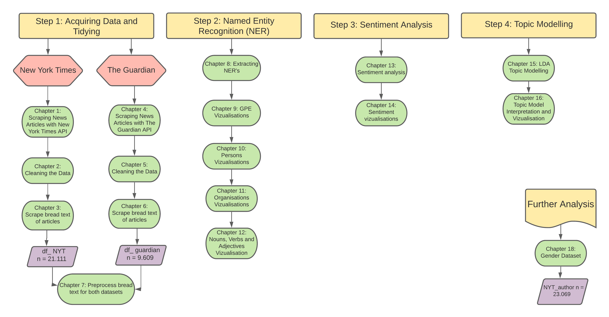

# Implementing Natural Language Processing to Examine the Lens of News Media

Here you find all the accompanying code for the exam project in the course *Introduction to Cultural Data Science*
in the autumn of 2021 at the University of Aarhus.

## Project Description

The aim of the project is to investegate the lens of news media by using natural
language processing on a large corpus of news articles. I conduct a named entity recognition and sentiment analysis. 

Future implementations could be topic modelling and an analysis by gender. 
It would also be useful to incorporate a non-western newspaper such as Al Jazeera.   

## Files in the Repository

### Reproducibility Notebook
The most relevant file in the repository is the *Reproducibility Notebook*. 
This file presents all the accompanying code as a notebook using r-markdown and the package bookdown.
If you want to reproduce and understand the code for the project please go to this file. 

Here is an overview of the content in the reproducibility notebook.

* In step 1 I acquire the data needed and tidy so it is ready for analysis. 
* In step 2 I make Named Entity Recognition (NER) and plot.
* In step 3 i make a sentiment analysis and plot.
* In step 4 i make a LDA topic model and plot.
 
There are two options to view the reproducibility notebook. I recommend option 1. 

1. The slow but more robust option: First, clone the repository to a local repository. Then navigate to the folder named
*_book* and open the file named *index.html*. I open the file in Google Chrome and it runs smoothly. 
2. The quick but slightly buggy option: Simply go to the webpage: https://htmlpreview.github.io/?https://raw.githubusercontent.com/ah140797/news_media_NLP/master/_book/index.html

### Other files

You will also find the following folders:

* *_book* which contains a ton of files for producing the reproduciblity notebook.
* *data/* which contains all the data and a metadata-file with a brief description of all the datasets.
* *figures/* which contains all the figures produced in R.
* *images/* which contains the images that are used inside the reproducibility notebook.
* *python_scripts/* which contains all the python scripts in the format of Jupyter Notebook. It also contains all the data necessary to run the python code.
* *r_scripts/* which contain 23 r-markdown scripts named through *01_*, *02_* etc. Each script
corresponds to a chapter in the reproducibility notebook. The file *index.Rmd* is the first chapter of the reproducibility notebook.
* *shinyapp/* which contains all the scripts and data for running the shinyapp. 
The app is hosted online: https://ah140797.shinyapps.io/shinyapp/. 
If the link doesn’t work the application can be run in R. First, clone the repository to a local repository.
Then navigate to the folder *shinyapp/* and open the file called *app.R* in RStudio. Then run the commands:
`library(shiny)` and `runApp("<your working directory>/shinyapp/app.R")`

## prerequisites

Running the project requires some programming languages and integrated development enviroments (IDE). 
The programming languages in the project are Python and R.
The IDE's in the project are Jupyter Notebook (which runs in the enviroment of Anaconda) and RStudio. 

